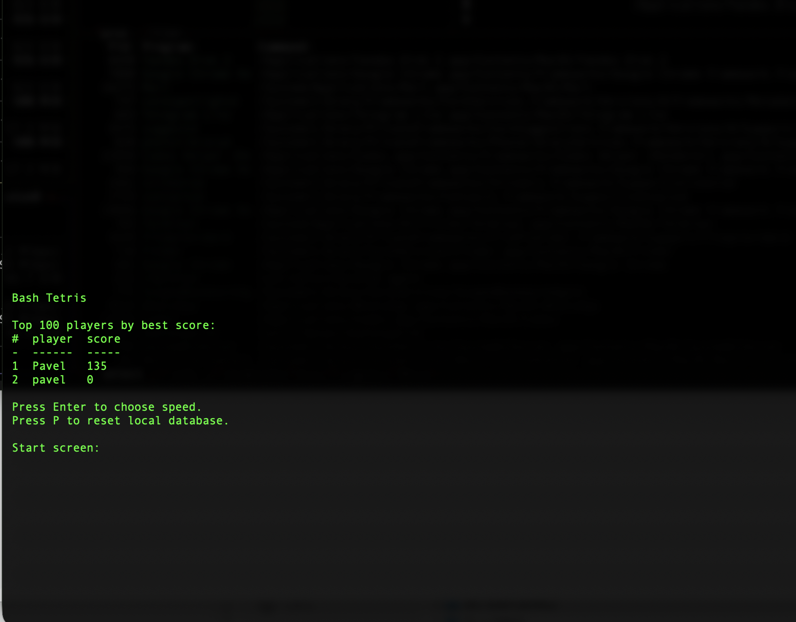
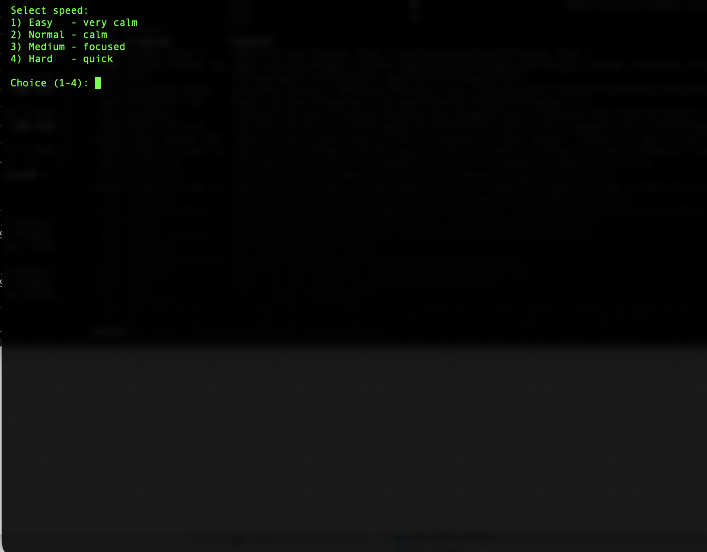
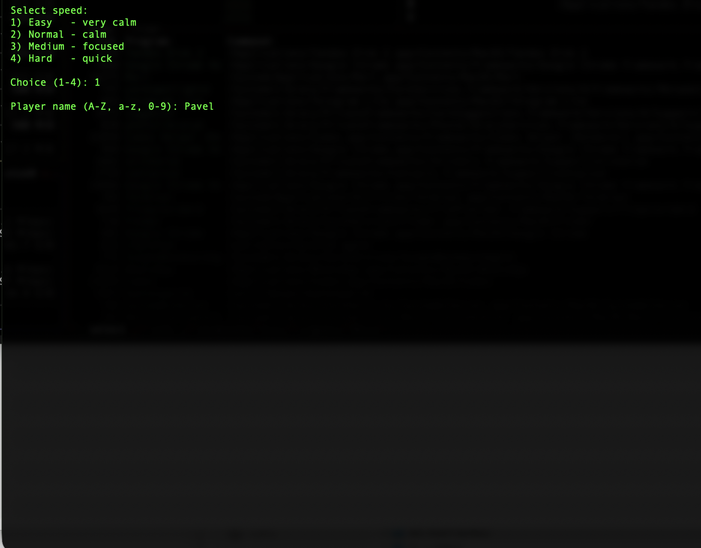
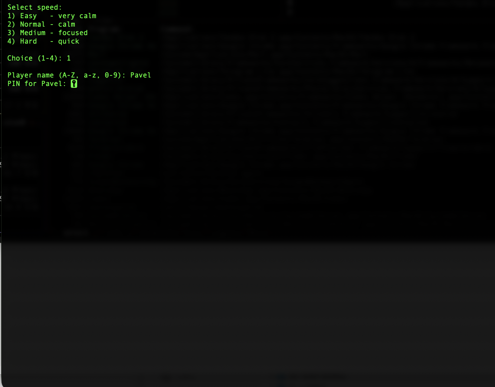
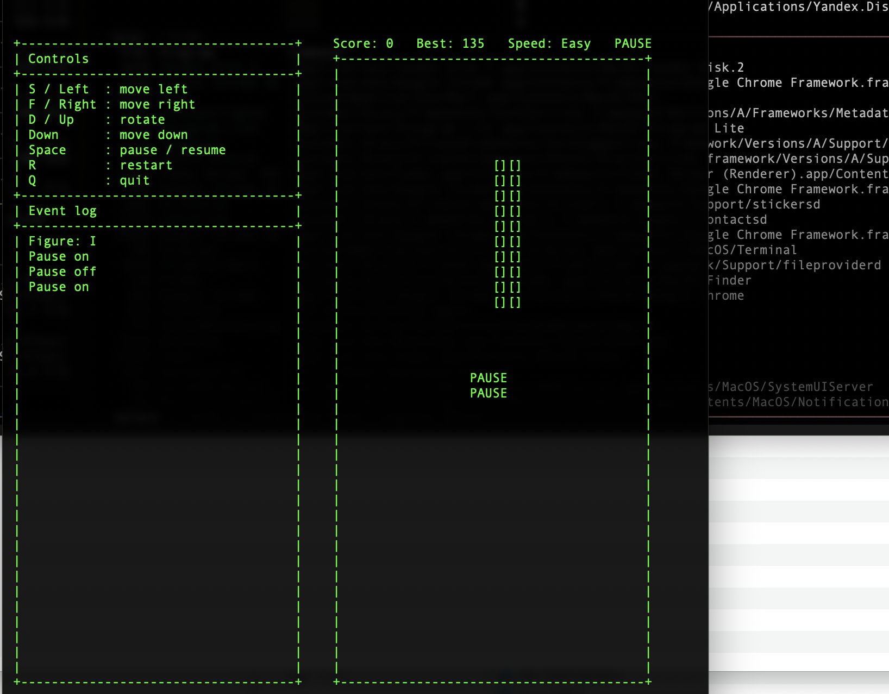
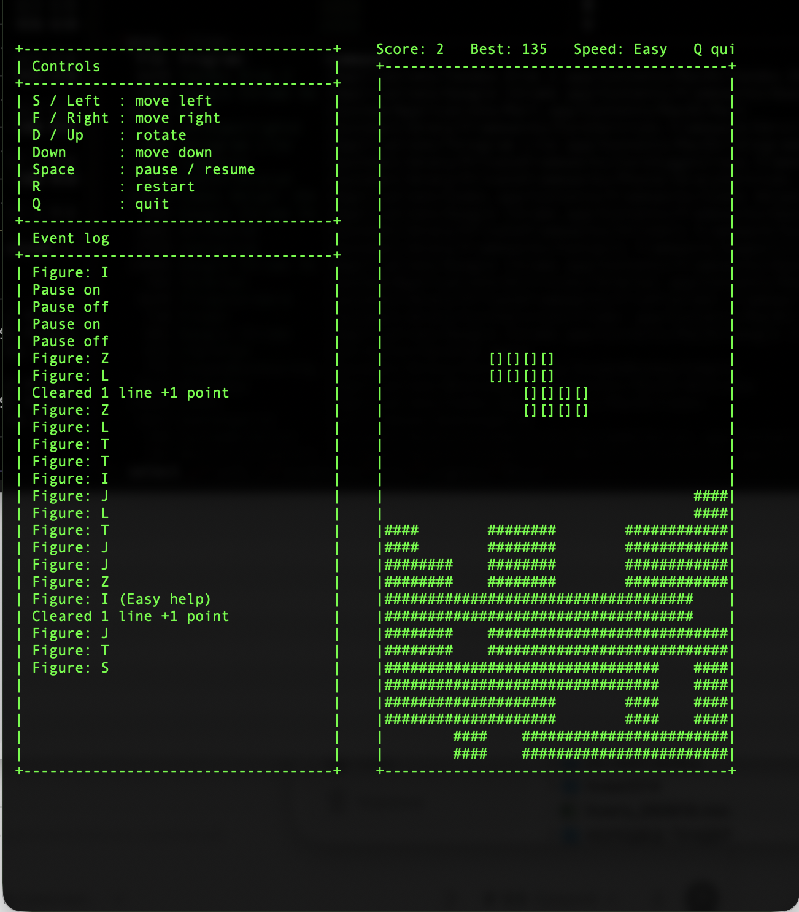

# Bash Tetris

Bash Tetris is a terminal-based Tetris-style game written in Bash. It runs directly in the console, draws the game board in fullscreen mode, and stores local player records in SQLite.

## Screenshots













## Pieces

The game has 7 pieces:

```text
I - a straight 5-cell line

[]
[]
[]
[]
[]
```

```text
O - a 3 by 3 square

[][][]
[][][]
[][][]
```

```text
T - a T-shaped piece

[][][]
  []
  []
```

```text
S - a right-shifted piece

[][]
  [][]
```

```text
Z - a left-shifted piece

  [][]
[][]
```

```text
J - a J-shaped piece

  []
  []
[][]
```

```text
L - an L-shaped piece

[]
[]
[][]
```

## Start Screen

When the game starts, it first shows the top 100 players by best score.

From this screen:

```text
Enter - continue to speed selection
P     - reset local database
```

`P` / `p` works only on this start screen. It does not work during gameplay, while entering a player name, or on the speed selection screen.

## Speed Levels

Before the game starts, you can choose one of four speed levels:

```text
1. Easy   - the calmest mode
2. Normal - regular speed
3. Medium - faster mode
4. Hard   - the fastest mode
```

In Easy mode, the game gives the player a little help. If the board has a vertical empty gap at least 3 cells deep, the game may give an `I` piece so the gap is easier to fill.

## Database Reset

On the start screen, before choosing a speed level and before entering a player name, press `P` or `p` to reset the local database.

The game asks for confirmation:

```text
Delete all local players and scores? (y/n):
```

Press `y` or `Y` to confirm. Press `n`, `N`, or any other key to cancel.

When confirmed, the database file is deleted completely and recreated from scratch. All saved players, PIN codes, and scores are removed.

After the reset, the game shows the top players table again. It should be empty and display:

```text
No players yet.
```

## Controls

```text
S or Left Arrow   - move left
F or Right Arrow  - move right
D or Up Arrow     - rotate piece
Down Arrow        - move down
Space             - pause / resume
R                 - restart the current game
Q                 - quit
```

Letter commands are case-insensitive. For example, `s` and `S` both move left, `f` and `F` both move right, `d` and `D` both rotate, `r` and `R` both restart the game, and `q` and `Q` both quit.

## Pause

The game has a pause mode. Press `Space` to pause or resume.

While paused, the piece stops falling, movement controls are temporarily disabled, and `PAUSE` appears in the center of the board.

Pause mode is useful when you need to step away, answer the phone, or take a short break without losing the current game.

## Restart

Press `R` or `r` to restart the current game.

Restart keeps the same player, selected speed level, and saved best score. The current board is cleared, the current score is reset to zero, pause mode is turned off, and a new piece appears.

Before restarting, the game checks the current score and saves it as a new best score if the record has been beaten.

## Scoring

Points are awarded only for cleared lines:

```text
1 line  = 1 point
2 lines = 3 points
3 lines = 6 points
4 lines = 24 points
5 lines = 120 points
```

The `I` piece is 5 cells long, so clearing 5 lines at once is possible.

## Event Log

An event log is shown in the fixed left-side panel. It shows what happens during the game without changing the height of the game board:

- which piece appeared;
- when Easy mode help was used;
- how many lines were cleared;
- how many points were awarded;
- when pause was enabled or disabled;
- when the game was restarted;
- when a new best score was saved.

Example log entries:

```text
Figure: L
Figure: I (Easy help)
Cleared 1 line +1 point
Cleared 3 lines +6 points
Pause on
Pause off
Game restarted
New best score saved: 24
```

## Database

The game uses a local SQLite database to store players and their best scores.

The database is created automatically next to the game script. The file is named:

```text
tetris_scores.sqlite3
```

On first launch, the player enters a name and a PIN code. Player names can contain only English letters and digits.

If the name is new, the game creates a player in the database.

The database stores:

```text
name  - player name
pin   - PIN code
score - player's best score
```

If the name already exists, the game asks for the PIN. If the PIN is correct, the player starts a new game under that name. Every new game starts with a score of zero.

If the PIN is unknown, the player must choose another name.

The PIN is stored in plain text because this is a simple local game without server-side authentication.

## Records

The database stores the player's best score, not the sum of all games.

Whenever the player earns points, the game immediately checks whether the current score is higher than the saved best score. If the record is beaten, it is written to SQLite immediately, without waiting for game over.

This makes record saving more reliable. If the game unexpectedly exits, the computer restarts, or power is lost, an already beaten record remains saved.

When the player quits with `Q` or loses the game, the game performs one final record check and saves it if needed.

## Top Players

On the start screen, the game shows the top 100 players by best score.

Players are sorted by the `score` field. The more points a player has, the higher they appear in the table.

## GitHub and Local Data

The database file should not be committed to GitHub. It contains local data for one specific computer.

The repository includes the game code, but not the player database.

The database is excluded through `.gitignore`:

```text
tetris_scores.sqlite3
*.sqlite3
*.db
```

## Run

```bash
./tetris.sh
```
